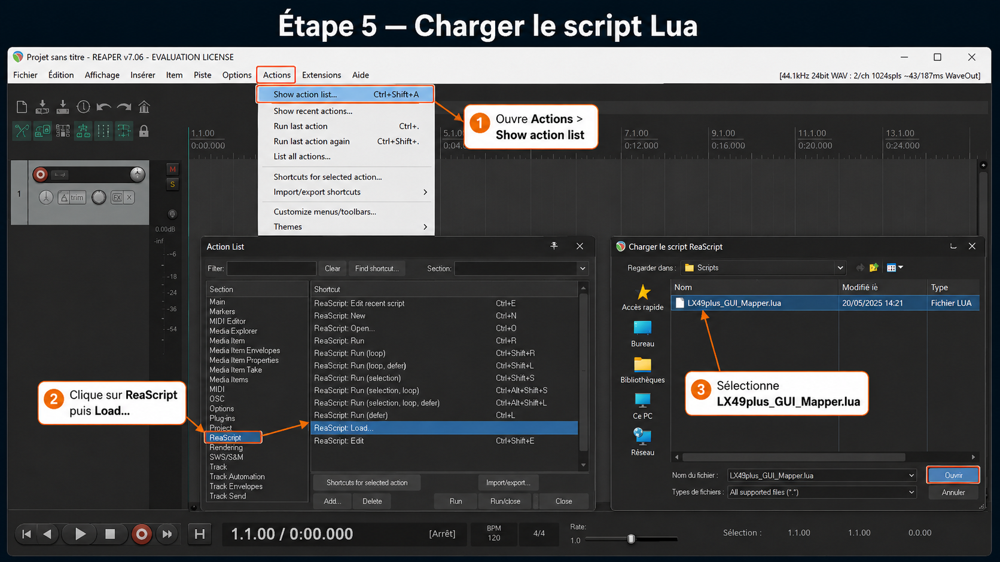
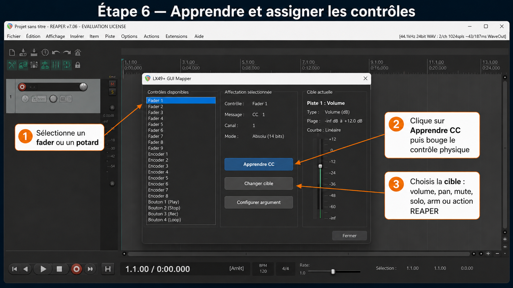

# LX49+ Mapper pour REAPER — version simplifiée

Cette version remplace l’installation longue par un **script unique** :

```text
LX49plus_Mapper_OneClick.lua
```

Le script OneClick fait tout ça automatiquement.

---


La solution simplifiée garde le bon choix technique :

- **ReaScript** pour contrôler REAPER directement ;
- **JSFX bridge** pour recevoir les CC MIDI en temps réel ;
- **un seul fichier à lancer** pour masquer toute la partie technique.

---

## Installation ultra-simple

### 1. Dézippe le dossier

Dézippe :

```text
lx49plus_reaper_mapper.zip
```

Garde le dossier où tu veux, par exemple sur le Bureau ou dans Documents.

---

### 2. Charge le script OneClick dans REAPER

Dans REAPER :

```text
Actions > Show action list
```

Puis :
Dans l'Action List, utilise :

```text
New action... > Load ReaScript...
```

Puis sélectionne :

```text
New action... > Load ReaScript...
```

Sélectionne le fichier :

```text
LX49plus_Mapper_OneClick.lua
```

`Load ReaScript...` ajoute le script dans REAPER, mais ne le lance pas toujours immédiatement.

---

### 3. Lancer le script

Dans l’Action List :

1. clique sur `Clear` pour vider le filtre ;
2. tape `LX49` dans `Filter` ;
3. sélectionne `Script: LX49plus_Mapper_OneClick.lua` ;
4. clique sur `Run` ou `Run/close`.

---

## Ce que le script fait automatiquement

Au lancement, `LX49plus_Mapper_OneClick.lua` :

1. installe automatiquement le bridge JSFX dans le dossier `Effects` de REAPER ;
2. crée ou retrouve une piste nommée `LX49+ CONTROL` ;
3. arme cette piste ;
4. active le monitoring ;
5. essaie de choisir automatiquement l’entrée MIDI du Nektar Impact LX49+ ;
6. ajoute le FX `JS: LX49+ CC Bridge to ReaScript` sur la piste ;
7. ouvre directement l’interface graphique du mapper.

Après ça, tu dois seulement utiliser l’interface.

---

## Utilisation

Dans la fenêtre **LX49+ Mapper** :

1. clique sur un contrôle virtuel, par exemple `Fader 1` ou `Potard 1` ;
2. clique sur `Apprendre CC` ;
3. bouge le fader, le potard ou le bouton physique du LX49+ ;
4. clique sur `Changer cible` pour choisir ce que le contrôle doit piloter ;
5. clique sur `Configurer argument` si la cible demande un numéro de piste ou un ID d’action REAPER.

Tu peux aussi tout faire au clavier (plus rapide pour l’assignation) :

| Touche | Action |
| --- | --- |
| `N` / `P` | contrôle suivant / précédent |
| `L` | apprendre le CC du contrôle sélectionné |
| `C` | changer la cible |
| `A` | configurer l’argument (piste/action) |
| `G` | configurer la plage MIDI min/max |
| `I` | inverser la plage |
| `R` | reset du contrôle |
| `S` | sauvegarder |
| `H` | afficher/masquer l’aide clavier |
| `Esc` | quitter |

Cibles disponibles :

- volume de la piste sélectionnée ;
- pan de la piste sélectionnée ;
- volume d’une piste précise ;
- pan d’une piste précise ;
- volume master ;
- mute piste ;
- solo piste ;
- arm piste ;
- action REAPER par ID numérique ou ID nommé `_...`.

Les mappings sont sauvegardés automatiquement dans REAPER.

---

## Si rien ne bouge dans l’interface

Vérifie d’abord ceci :

1. le LX49+ est bien branché avant d’ouvrir REAPER ;
2. dans REAPER, va dans :

```text
Options > Preferences > MIDI Devices
```

3. l’entrée MIDI du Nektar Impact LX49+ doit être activée ;
4. relance `LX49plus_Mapper_OneClick.lua`.

Si le script affiche que la piste est prête mais qu’aucun CC n’arrive, sélectionne manuellement l’entrée MIDI sur la piste `LX49+ CONTROL` :

```text
Input: MIDI > Impact LX49+ > All channels
```

La piste doit rester :


Important : dans REAPER, `Load ReaScript...` sert surtout à **ajouter le script dans l'Action List**. Il ne lance pas toujours l'interface immédiatement.

Après avoir cliqué sur `Ouvrir` :

1. ferme la fenêtre de sélection de fichier si elle est encore ouverte ;
2. dans l'Action List, clique sur `Clear` pour effacer le filtre actuel ;
3. cherche `LX49` dans le champ `Filter` ;
4. sélectionne `Script: LX49plus_GUI_Mapper.lua` ou `LX49plus_GUI_Mapper` ;
5. clique sur `Run` ou `Run/close`.

Si Windows masque les extensions, le fichier peut apparaître comme `LX49plus_GUI_Mapper` au lieu de `LX49plus_GUI_Mapper.lua`. C'est normal si le type affiché est `Fichier source Lua`.

Tu peux aussi lui assigner un raccourci clavier ou l'ajouter à une toolbar REAPER une fois qu'il apparaît dans l'Action List.

---

### Étape 6 — Apprendre et assigner les contrôles

Dans l'interface `LX49+ GUI Mapper` :

1. sélectionne un contrôle virtuel, par exemple `Fader 1` ou `Encoder 1` ;
2. clique sur `Apprendre CC` (ou touche `L`) ;
3. bouge le fader, le potard ou le bouton physique correspondant sur le LX49+ ;
4. clique sur `Changer cible` (ou touche `C`) pour choisir la destination ;
5. clique sur `Configurer argument` (ou touche `A`) pour choisir le numéro de piste ou l'ID d'action REAPER.



---

## Piste MIDI bridge

La piste bridge doit rester active pendant l'utilisation du mapper.

Configuration attendue :

```text
Record arm        : ON
Record monitoring : ON
FX                : JS: LX49+ CC Bridge to ReaScript
```

---

## Si le JSFX n’est pas ajouté automatiquement

Le script écrit le fichier JSFX dans le dossier `Effects` de REAPER. Si REAPER ne le voit pas tout de suite :

1. ferme REAPER ;
2. rouvre REAPER ;
3. relance `LX49plus_Mapper_OneClick.lua`.

Le script réessaiera de créer la piste et d’ajouter le FX.

---

## Fichiers du dossier

```text
lx49plus_reaper_mapper/
├── LX49plus_Mapper_OneClick.lua      <- fichier recommandé
├── LX49plus_CC_Bridge.jsfx           <- version séparée, pour dépannage
├── LX49plus_GUI_Mapper.lua           <- version séparée, pour dépannage
├── README_INSTALLATION.md
└── images/                           <- ancien tutoriel illustré manuel
```

Utilise en priorité :

```text
LX49plus_Mapper_OneClick.lua
```

Les deux autres fichiers sont gardés seulement pour une installation manuelle ou du dépannage.

---

## Résumé

Ancienne méthode : copier deux fichiers, créer une piste, choisir l’entrée MIDI, armer la piste, ajouter le JSFX, charger le script Lua, puis lancer le script.

Nouvelle méthode :

```text
Load ReaScript > LX49plus_Mapper_OneClick.lua > Run
```

Have fun !
