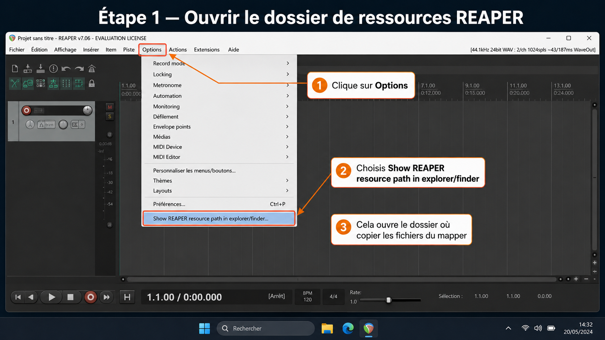
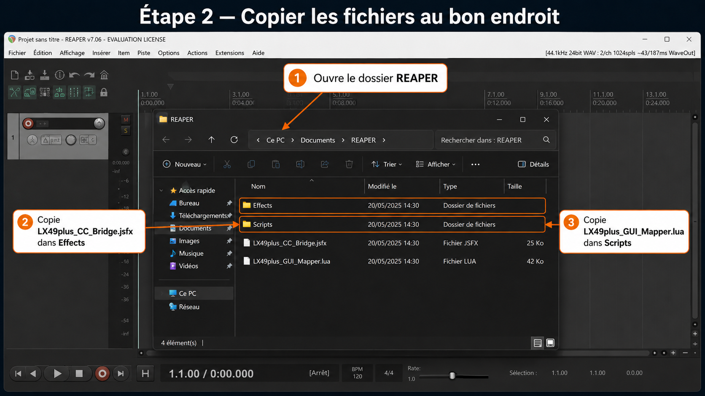
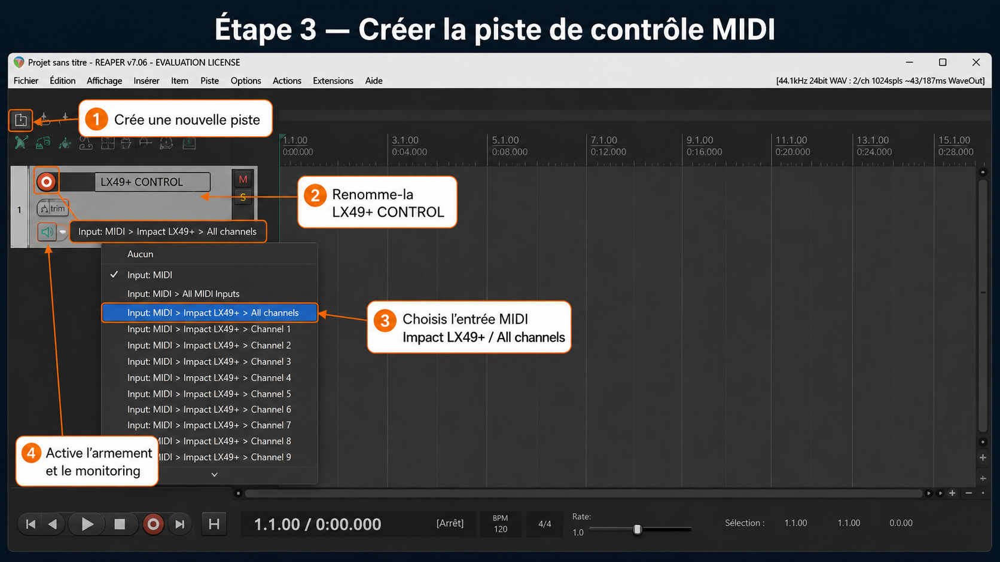
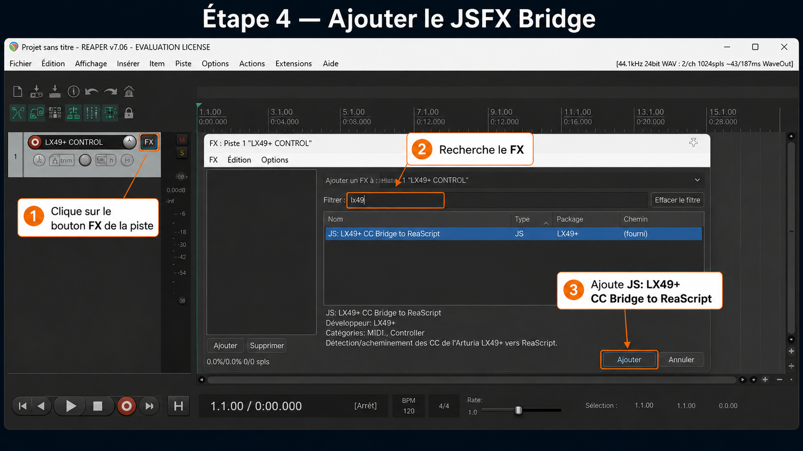

# LX49+ Mapper pour REAPER

Prototype ReaScript + JSFX pour apprendre et mapper les potards, faders et boutons d'un **Nektar Impact LX49+** dans **REAPER**, avec une interface graphique dédiée.

Le système fonctionne en deux parties :

- `LX49plus_CC_Bridge.jsfx` : petit JSFX à insérer sur une piste MIDI. Il lit les CC entrants et les publie dans une mémoire partagée `gmem`.
- `LX49plus_GUI_Mapper.lua` : interface graphique native REAPER, basée sur `gfx`, pour apprendre les CC et les mapper vers des pistes, le master ou des actions REAPER.

---

## Contenu du dossier

```text
lx49plus_reaper_mapper/
├── LX49plus_CC_Bridge.jsfx
├── LX49plus_GUI_Mapper.lua
├── README_INSTALLATION.md
└── images/
    ├── etape_1_ouvrir_dossier_reaper.png
    ├── etape_2_copier_fichiers_reaper.png
    ├── etape_3_creer_piste_midi.png
    ├── etape_4_ajouter_jsfx_bridge.png
    ├── etape_5_charger_script_lua.png
    └── etape_6_apprendre_assigner_controles.png
```

---

## Installation rapide

1. Dans REAPER : `Options > Show REAPER resource path in explorer/finder`.
2. Copie `LX49plus_CC_Bridge.jsfx` dans le dossier `Effects`.
3. Copie `LX49plus_GUI_Mapper.lua` dans le dossier `Scripts`.
4. Crée une piste dédiée nommée `LX49+ CONTROL`.
5. Mets son entrée MIDI sur `Impact LX49+ > All channels`.
6. Active l'armement d'enregistrement et le monitoring de la piste.
7. Ajoute le FX `JS: LX49+ CC Bridge to ReaScript` sur cette piste.
8. Dans REAPER : `Actions > Show action list > ReaScript > Load...`, puis choisis `LX49plus_GUI_Mapper.lua`.
9. Lance le script Lua depuis l'Action List.

---

## Tutoriel illustré

Les images ci-dessous montrent le déroulé complet dans REAPER. Elles sont fournies comme repères visuels pour l'installation et l'utilisation du mapper.

### Étape 1 — Ouvrir le dossier de ressources REAPER

Dans REAPER, ouvre le menu `Options`, puis clique sur `Show REAPER resource path in explorer/finder`. Cela ouvre le dossier où REAPER stocke ses scripts, effets JSFX, presets et ressources utilisateur.



---

### Étape 2 — Copier les fichiers au bon endroit

Dans le dossier de ressources REAPER :

- copie `LX49plus_CC_Bridge.jsfx` dans le dossier `Effects` ;
- copie `LX49plus_GUI_Mapper.lua` dans le dossier `Scripts`.



Après la copie, redémarre REAPER ou lance un scan des nouveaux effets JSFX si le bridge n'apparaît pas dans le navigateur FX.

---

### Étape 3 — Créer la piste de contrôle MIDI

Crée une piste dédiée, par exemple nommée `LX49+ CONTROL`.

Réglages recommandés :

- entrée MIDI : `Impact LX49+ > All channels` ;
- record arm : activé ;
- monitoring : activé.



Cette piste ne sert pas à enregistrer de l'audio. Elle sert à recevoir les messages MIDI du LX49+ et à les transmettre au script de mapping.

---

### Étape 4 — Ajouter le JSFX Bridge

Sur la piste `LX49+ CONTROL`, clique sur le bouton `FX`, recherche `LX49+`, puis ajoute :

```text
JS: LX49+ CC Bridge to ReaScript
```



Le bridge JSFX sert de pont entre le flux MIDI de la piste et l'interface Lua. Sans lui, le script Lua ne reçoit pas directement les CC du contrôleur.

---

### Étape 5 — Charger le script Lua

Dans REAPER, ouvre :

```text
Actions > Show action list
```

Dans l'Action List, va dans la section `ReaScript`, clique sur `Load...`, puis sélectionne :

```text
LX49plus_GUI_Mapper.lua
```


Une fois chargé, le script peut être lancé depuis l'Action List. Tu peux aussi lui assigner un raccourci clavier ou l'ajouter à une toolbar REAPER.

---

### Étape 6 — Apprendre et assigner les contrôles

Dans l'interface `LX49+ GUI Mapper` :

1. sélectionne un contrôle virtuel, par exemple `Fader 1` ou `Encoder 1` ;
2. clique sur `Apprendre CC` ;
3. bouge le fader, le potard ou le bouton physique correspondant sur le LX49+ ;
4. clique sur `Changer cible` pour choisir la destination ;
5. clique sur `Configurer argument` pour choisir le numéro de piste ou l'ID d'action REAPER.


---

## Piste MIDI bridge

La piste bridge doit rester active pendant l'utilisation du mapper.

Configuration attendue :

```text
Nom de piste      : LX49+ CONTROL
Entrée MIDI       : Impact LX49+ > All channels
Record arm        : ON
Record monitoring : ON
FX                : JS: LX49+ CC Bridge to ReaScript
```

Le script Lua ne reçoit pas directement le MIDI brut de REAPER : le JSFX sert de pont fiable entre le flux MIDI de la piste et l'interface graphique.

---

## Utilisation détaillée

1. Lance `LX49plus_GUI_Mapper.lua` depuis l'Action List.
2. Clique un fader, potard ou bouton dans l'interface.
3. Clique `Apprendre CC`.
4. Bouge le contrôle physique correspondant sur le LX49+.
5. Clique `Changer cible` pour choisir la destination.
6. Clique `Configurer argument` pour choisir le numéro de piste ou l'ID d'action.

Types de cibles prévus :

- volume de piste ;
- pan de piste ;
- volume master ;
- mute ;
- solo ;
- arm ;
- action REAPER par ID d'action.

---

## Notes importantes

- Les mappings sont sauvegardés dans l'ExtState REAPER et reviennent au prochain lancement.
- Les volumes sont mappés de `-60 dB` à `0 dB`, ce qui évite les boosts accidentels.
- Les actions se déclenchent uniquement au passage au-dessus de `64`, pratique pour les boutons qui envoient `127` à l'appui puis `0` au relâchement.
- Si rien ne bouge dans l'interface, vérifie la piste bridge : armée, monitoring activé, entrée MIDI du LX49+ activée, JSFX chargé.
- Si le JSFX n'apparaît pas dans le navigateur FX, vérifie que le fichier `.jsfx` est bien dans `Effects`, puis redémarre REAPER.

---

## Dépannage rapide

### Le script s'ouvre mais ne reçoit aucun CC

Vérifie :

1. le LX49+ est bien reconnu comme périphérique MIDI dans REAPER ;
2. la piste `LX49+ CONTROL` est armée ;
3. le monitoring est activé ;
4. l'entrée de piste est bien `Impact LX49+ > All channels` ;
5. le JSFX `LX49+ CC Bridge to ReaScript` est bien chargé sur cette piste.

### Le JSFX n'apparaît pas

Vérifie que `LX49plus_CC_Bridge.jsfx` est placé dans :

```text
REAPER resource path/Effects/
```

Puis redémarre REAPER.

### Le script Lua n'apparaît pas dans l'Action List

Recharge-le avec :

```text
Actions > Show action list > ReaScript > Load...
```

Puis sélectionne :

```text
LX49plus_GUI_Mapper.lua
```
